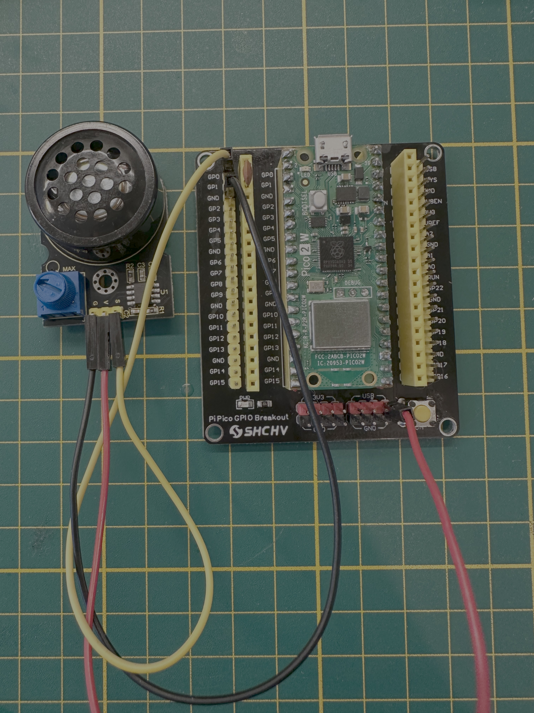

# Pico WAV Player (PWM + DMA)

Plays an embedded WAV file out of the RP2040/RP2350 PWM pin (`GPIO0`) using a simple RC filter + speaker. Samples are streamed via DMA paced by a second PWM slice, keeping the CPU mostly idle during playback.

## Build
- Configure once: `cmake -S . -B build`
- Build: `ninja -C build`
- Output UF2: `build/pico-wav-c.uf2`

## Flash to Pico
- Hold BOOTSEL on the Pico and plug in USB; a drive named RPI-RP2 appears.
- Copy `build/pico-wav-c.uf2` to that drive (drag/drop or `cp`).
- The Pico reboots and begins playing immediately.

## Wiring
- Connect `GPIO0` through an RC filter (e.g., 10 kΩ + 0.1 µF) into your amplifier/speaker input.
- Share ground between Pico and amplifier.
- The PWM slice used for DMA pacing does not require an extra pin.

## Configuration
- Default audio pin is `GPIO0` (`AUDIO_PIN` in `pico-wav-c.c`). Change it if needed and reflash.

## Converting your own WAV
- The player supports PCM WAV only (no compression), 8- or 16-bit, mono or stereo. Stereo is downmixed by channel stride; sample rate is played as-is.
- Recommended: convert to mono 8-bit unsigned PCM to match the PWM wrap (0–255).
  - Example with ffmpeg: `ffmpeg -i in.wav -ac 1 -ar 16000 -sample_fmt u8 sound.wav`
- Convert the WAV into a C header:
  - `xxd -i sound.wav > wav_data.h`
  - Ensure the header keeps the symbols `wav_data` and `wav_data_len` (rename if needed).
- Rebuild: `ninja -C build` and reflash the new UF2.

## Notes
- If playback is silent, double-check: WAV is PCM (not ADPCM/MP3), sample rate is non-zero, and the header file is included as `wav_data.h`.
- Playback continues with silence once the WAV data ends; reset or power-cycle to replay.
